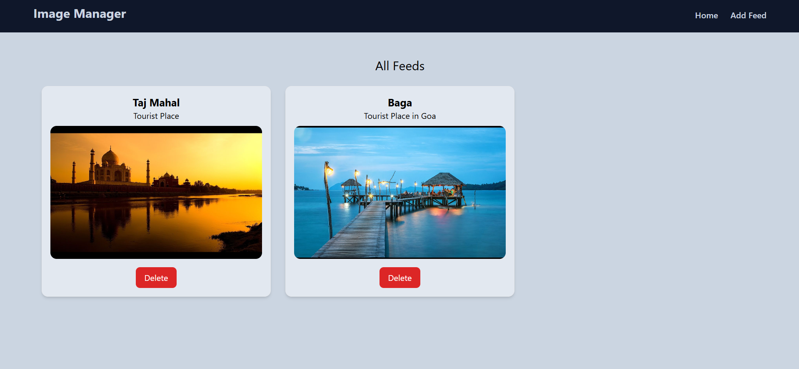
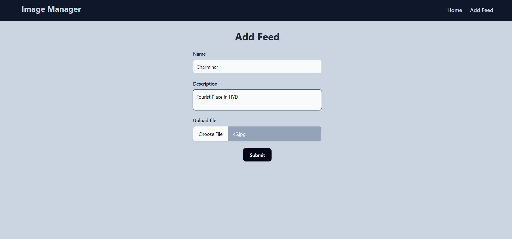

# **AWS S3 Image Storage**

## Project Overview

This project enables image uploads, storage, and retrieval using AWS S3. It consists of a client-side built with React.js and a server-side using Node.js, Express.js, and AWS SDK to handle image uploads and storage in S3.

---

## Demo




---

## Tech Stack

### **Client**

- **React.js**: UI components and routing
- **React Router**: For client-side navigation

### **Server**

- **Node.js**: Backend runtime environment
- **Express.js**: Web framework for building the API
- **Multer**: Middleware for handling image uploads
- **AWS SDK**: Interacting with AWS S3 for image storage

### **Storage**

- **AWS S3**: For storing and retrieving uploaded images

---

## Key Features

- **Image Upload**: Upload images to AWS S3 via the server.
- **Image Retrieval**: Fetch uploaded images from S3.
- **Image Deletion**: Delete images from AWS S3.
- **Responsive UI**: Simple interface for uploading, viewing, and deleting images.

---

## Environment Variables

To run this project, you will need to add the following environment variables to your `.env` file:

```env
PORT=<Your preferred port number>
MONGO_URI=<Your MongoDB connection string>
BUCKET_NAME=<Your AWS S3 bucket name>
BUCKET_REGION=<Your AWS S3 bucket region>
ACCESS_KEY=<Your AWS access key>
SECRET_ACCESS_KEY=<Your AWS secret access key>
```

---

## Run Locally

1. **Clone the project**

   ```bash
   git clone https://github.com/sanjithrk06/S3-Image-Storage.git
   ```

2. **Go to the project directory**

   ```bash
   cd S3-Image-Storage
   ```

3. **Install dependencies**

   For the client:

   ```bash
   cd client
   npm install
   ```

   For the server:

   ```bash
   cd server
   npm install
   ```

4. **Create a .env file**

   Add the required environment variables as shown above.

5. **Start the server**

   ```bash
   cd server
   npm run start
   ```

6. **Start the client**

   ```bash
   cd client
   npm run start
   ```

The server will start on the port you specified in the .env file, and the client will start on port 3000 by default.

---

## API Documentation

### **Server Routes**

| Method     | End Point   | Description             |
| ---------- | ----------- | ----------------------- |
| **GET**    | `/feed`     | Fetch all stored images |
| **POST**   | `/feed`     | Upload a new image      |
| **DELETE** | `/feed/:id` | Delete an image by ID   |

### **Request Headers for Image Upload**

When uploading an image, send the image in multipart/form-data format.

---

## Client Routing

The client-side routing is handled by React Router.

| Route   | Description                  |
| ------- | ---------------------------- |
| `/`     | Home page to view images     |
| `/form` | Form page to upload an image |

---

## Project Structure

```bash
AWS-S3-Image-Storage/
│
├── client/
│   ├── public/
│   ├── src/
│   │   ├── components/
│   │   │   ├── Form.js
│   │   │   ├── Home.js
│   │   ├── layouts/
│   │   │   └── MainLayout.js
│   │   ├── App.js
│   │   └── index.js
│   ├── package.json
│   └── README.md
│
├── server/
│   ├── controllers/
│   │   └── feedController.js
│   ├── models/
│   │   └── feed.model.js
│   ├── routes/
│   │   └── feedRoutes.js
│   ├── .env
│   ├── server.js
│   ├── package.json
│   └── README.md
│
└── README.md
```

---

## How to Use

### **Home Page**

- Displays all the images fetched from AWS S3 with image details.
- Each image has a Delete button to remove the image from both the database and AWS S3.

### **Form Page**

- Allows users to upload an image to AWS S3.
- The form captures the image, title, and description, which are stored in both MongoDB and S3.

---

## License

This project is licensed under the MIT License. You are free to use, modify, and distribute it as you see fit.

---
